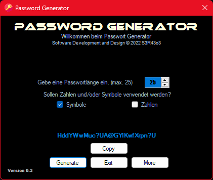

# Password Generator #

> A lightweight tool to generate Passwords for you.
>
>This software is currently only avaible in german language, a english version will released soon.

## Installation ##

> To install the software just Download the last [Release Version](https://github.com/sera619/PasswordGenerator/releases/tag/v0.0.1) and unzip it.
> Run the contained "setup.exe" and youre done.
> If you faceing any issues please open a [new issue](https://github.com/sera619/PasswordGenerator/issues)
>
>
